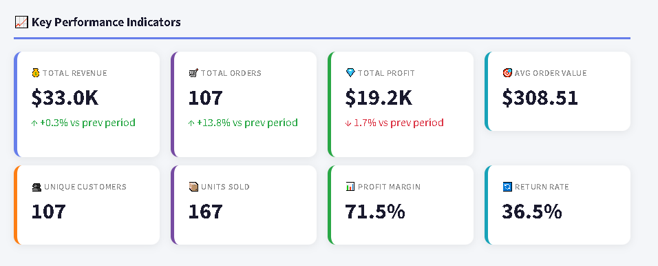

# 📊 Sales Tracker Dashboard

> Real-time sales analytics dashboard built with Python and Streamlit

## 🔗 Live Demo
### **[👉 View Live Dashboard Here](https://akshaysom21-sales-tracker-dashboard-app.streamlit.app/)**

---

## 📸 Dashboard Preview

### Overview - KPI Tracking

### Product Performance

### Customer Analytics

### Sales Channel Analysis

### Time Patterns

### 30-Day Forecast

---

## ✨ Features
- 📈 Real-time KPI tracking with period-over-period comparison
- 🏆 Product and category performance analysis
- 👥 Customer segmentation (New vs Returning customers)
- 📢 Sales channel ROI comparison
- ⏰ Time pattern analysis (best hours and days to sell)
- 🔮 30-day revenue forecasting with confidence bands
- 📧 Automated email reports (daily, weekly, monthly)
- 🗂️ Raw data explorer with CSV and JSON export
- 🔍 Multi-filter system (date, category, channel, region)

---

## 🛠️ Tech Stack

| Tool | Purpose |
|------|---------|
| Python 3.10 | Core language |
| Streamlit | Dashboard framework |
| Pandas | Data processing and analysis |
| Plotly | Interactive charts |
| Scikit-learn | Sales forecasting model |
| Prophet | Advanced time series forecasting |
| SMTP | Automated email reports |

---

## 🚀 Run Locally

# Clone the repository
git clone https://github.com/akshaysom21/sales-tracker-dashboard.git

cd sales-tracker-dashboard

# Create virtual environment
python -m venv venv
venv\Scripts\activate

# Install dependencies
pip install -r requirements.txt

# Generate sample data
python data_generator.py
python data_processor.py

# Launch the dashboard
streamlit run app.py

# Open your browser at
http://localhost:8501

---

## 💼 Business Impact

| Problem | Solution | Impact |
|---------|----------|--------|
| Manual reporting takes hours | Automated dashboard | Saves 5-10 hours per week |
| No visibility into top products | Product performance tab | Instant identification |
| Unknown customer behaviour | Customer segmentation | Better targeting |
| No revenue forecast | ML forecasting model | 30-day predictions |
| Missed email reporting | Automated SMTP reports | Daily, weekly, monthly |

---

## 📁 Project Structure

sales_tracker_dashboard/
├── app.py                 # Main dashboard application
├── data_generator.py      # Sample data generation
├── data_processor.py      # Data cleaning pipeline
├── kpi_calculator.py      # Business metrics engine
├── forecasting.py         # ML forecasting module
├── email_report.py        # Automated email reports
├── config.py              # Central configuration
├── requirements.txt       # Dependencies
├── .streamlit/
│   └── config.toml        # Streamlit theme settings
└── data/
    ├── raw/               # Raw data files
    └── processed/         # Cleaned data files

---

## 📬 Contact

**Akshay Som**
- 🔗 LinkedIn: https://www.linkedin.com/in/akshaysom21/
- 💻 GitHub: https://github.com/akshaysom21
- 📧 Email: akshaysom21@gmail.com
